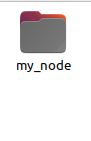

# 教学文档-导航组

# 零，如何学习这部分内容

上网搜索，问人，问gpt，自己上手实验，将错误内容复制下来上网搜索

有不懂的名词，不懂的错误，可以先不自己琢磨转而直接搜索，这部分内容总的来说，陌生新颖的东西比需要思考的东西更多，因此首先需要强大的信息搜索能力，在积累经验后可以自行思考琢磨，按经验行事

# 一，安装ubuntu22.04环境

首先下载ubuntu22.04镜像，接着按下列方法安装系统：

虚拟机：通过VMware加载镜像，安装虚拟机系统

双系统：自行搜索，有一定风险，不推荐在只有一台电脑且无法拆下硬盘的前提下操作

独立硬盘系统，U盘系统：只需在bios中切换，十分方便，几乎没风险，但需要自备一块额外的硬盘，对于笔记本用户来说，可以通过U盘装载系统

https://www.bilibili.com/video/BV12K4y1F785/?spm_id_from=333.999.0.0

在安装ubuntu后，相应的ubuntu常用操作也要学习，重点学习如何通过apt安装软件，编译后产生的文件，以及库，程序是如何安装到ubuntu系统中去，这有助于我们解决ros使用过程中的环境问题。

# 二，配置ROS2环境

## 0.ROS简介

        ROS俗称机器人操作系统，实际上是一个通信框架，开发者可以通过这个通信框架，搭建自己由多个硬件部分组合的机器人的软件上的连接，以此让机器人的各个部分都能够互相感知对方的存在，将对方作为软件中的对象进行把握操作，就像人的神经系统一样，由无数个神经元组成，神经元之间互相传输电信号，从而实现整个人体的运作。

        ROS最主要功能就是创建节点与节点间通信，节点就是独立的信箱，而消息就是那封信件，最终一个节点的信息会让另一个节点接收，并得到数据。也许看上去，我直接声明一个全局变量就可以解决数据交换的问题，但在不同线程，不同程序甚至说不同硬件间进行变量的交换就十分困难。

        此时，ROS这个通信框架就可以出来帮忙了，ROS以节点和消息方式搭建自己的通信框架，像桥梁一样，在不同程序不同线程运行时，我们只需要让两者都运行节点，约定好发布和接收的话题，那么消息就可以源源不断在不同节点间运输，从而实现在不同程序间进行传输，而无需考虑多程序多线程环境下，两者是否会在数据访问时越界，冲突，甚至是无法访问，我们只需要乖乖编写节点配置和算法处理，就能搭建出机器人的神经系统。

## 1.通过鱼香ROS一键安装ROS2 HUMBLE（对应ubuntu22.04)版本

```
wget http://fishros.com/install -O fishros && . fishros

```

※在此感谢鱼香ros作者小鱼对于ros开源社区的贡献，他所编写的ros入门教程与相关软件帮助了许多开发者。

※顺便通过这个软件下载vscode环境，以方便开发调试，我们在实机调试时也会通过vscode的远程调试工具ssh插件，进行无线调试，所以相应的ssh环境也可以熟悉熟悉。

※学会如何科学上网，以便访问github等外网资源

## 2.ROS常用工具

### 这些工具在调试与输出结果上十分方便，可自行搜索如何下载与使用

### rviz2

可视化软件，图像，点云，地图，标识都可以通过这个软件进行可视化，主要注重于三维信息，相当于你通过机器人的感官，展示它对世界是如何把握，看到了什么

### rqt

数据调试软件，提供简单的可视化与操作，用于搜索当前系统运行的节点与消息，同时也能进行消息的发布与监控，观测坐标变换的组成，即tf树的组成。

请确保这些软件能够正常使用，后边的软件设计与考核需要通过该软件检验。

### vscode

负责书写代码提供提示，安装后下载ROS插件，选择humble版本，以方便编写代码时ROS相关的代码能够正常提示。

# 三.配置ROS节点，创建简单的发布者与订阅者

## 0.安装仿真环境，方便后续调试

```bash
sudo apt-get install gazebo ros-humble-xacro ros-humble-joint-state-*
sudo apt-get install ros-humble-gazebo-ros ros-humble-gazebo-dev  
sudo apt-get install ros-humble-gazebo-plugins ros-humble-gazebo-ros-control
sudo apt-get install ros-humble-gazebo-planar-move* ros-humble-rqt-tf-tree 
sudo apt-get install ros-humble-nav-msgs ros-humble-sensor-msgs
```

在learn_ros_ws目录下运行以下代码并启动仿真，检验系统环境是否正常,这一步有任何问题都及时问人或者上网搜索
colcon build 用于编译项目，source用于更新可执行文件等编译好的文件的目录，
只有source后，ros2指令才能寻找到需要运行的执行文件，
该指令并非是永久生效，每一个新终端都需要配置，可以在~/.bashrc中添加，使每次终端打开时自动执行该指令来实现自动化
```bash
colcon build --packages-select learn_ros_simulation
source ./install/setup.bash
ros2 launch learn_ros_simulation rm_simulation.launch.py world:=CUBE use_sim_time:=True
```

打开ros2安装包自带的键盘速度控制器，通过ijklm来操纵小车的上下左右暂停

```cpp
ros2 run teleop_twist_keyboard teleop_twist_keyboard 
```

[Screencast from Saturday, August 24, 2024 04:43:56 PM HKT.webm](readme_source/Screencast_from_Saturday_August_24_2024_044356_PM_HKT.webm)

## 1.节点的创建与运行

### 1.1工作空间与代码存放地

工作空间就是你存放src文件夹和进行编译的地方（这个并不严格命名，本人命名learn_ros_ws中的ws就是workspace工作空间的缩写），而代码将统一放在src文件夹（即source——源码的缩写）中进行管理。

### 1.2创建功能包，编写节点

功能包可以理解为一个单独编译单独调用的一块程序，首先创建功能包：

```bash
ros2 pkg create my_node  --build-type  ament_cmake  --dependencies rclcpp
```

本文将首先使用节点加载器的方式运行节点并书写代码，有兴趣的可以看看如何以插件或组件方式运行节点，运行上述指令后，可以发现一个新的功能包



功能包内有include文件夹，src文件夹，cmakelist.txt文件和package.xml文件，cmakelist与package文件管理编译设置，我们将.cpp代码放在src文件夹下进行管理，在此文件夹下创建my_node.cpp


这是包含发布器和定时器的节点，通过定时器定期执行发布器，实现每秒10次发布消息效果

```cpp
#include "rclcpp/rclcpp.hpp"
#include "std_msgs/msg/string.hpp"

//节点的类，节点的任何功能我们都将在此规定节点运行时的行为
class my_node : public rclcpp::Node
{
public:
    //节点的构造函数，我们将在此初始化节点的各个功能外设
    my_node() : Node("my_forst_node")
    {
        //配置定时器
        my_timer = this->create_wall_timer(
            std::chrono::milliseconds(100),/*配置该定时器每100ms执行一次*/
            std::bind(&my_node::timer_callback, this)/*配置该定时器的回调函数timer_callback*/
            );

        //配置发布者，发布话题为HelloROS
        my_publisher = this->create_publisher<std_msgs::msg::String>("HelloROS",10);
    }
    

    
private:
    //一般来说，节点自带的函数与变量，指针的声明都不公开
    void timer_callback()
    {
        // 修改消息内容
        string_for_publish.data = "Ciallo~ (∠・ω< )⌒☆";

        // 发布消息
        my_publisher->publish(string_for_publish);
    }
    // 声名定时器指针，可以定期执行函数
    rclcpp::TimerBase::SharedPtr my_timer;

    rclcpp::Publisher<std_msgs::msg::String>::SharedPtr my_publisher;//创建发布者指针
    std_msgs::msg::String string_for_publish;//用来临时存放发布数据的变量
};

//节点执行器
int main(int argc, char** argv) {
  rclcpp::init(argc, argv);

  rclcpp::executors::SingleThreadedExecutor node_executor;//创建节点执行器
  
  auto node = std::make_shared<my_node>();//创建节点指针

  node_executor.add_node(node->get_node_base_interface());//让节点执行器装载节点

  node_executor.spin();//让节点执行器开始执行

  rclcpp::shutdown();
  return 0;
}
```

配置package.xml，在已有依赖rclcpp下添加std_msgs的依赖

```cpp
  <depend>rclcpp</depend>
  <depend>std_msgs</depend>
```

配置cmakelist.txt,将下段代码黏贴到ament_package()之前，rclcpp的包在创建时已经引入，可以直接接在这个依赖下边写

```cpp
#引入编译需要的外部功能包
find_package(rclcpp REQUIRED)
find_package(std_msgs REQUIRED)

#设置可执行项，也就是我们之后执行ros2 run时执行的目标
add_executable(my_node_exe src/my_node.cpp)

#设置编译依赖，单单引用头文件是不够的，你还需要在编译时连接、包含这个头文件其所在的功能包
ament_target_dependencies(my_node_exe rclcpp std_msgs)

#将编译好的可执行项安装
install(TARGETS my_node_exe
  DESTINATION lib/${PROJECT_NAME}
)
```

接着回到工作空间learn_ros_ws下，编译该功能包，更新编译项文件目录，并运行，
--pacakges-select用于选择需要编译的功能包，若不配置，则默认全部编译，我们选择my_node功能包进行编译，由于部分章节的依赖与文件目录不完整，在不进行其他章节的配置之前，请用该配置选择指定功能包进行编译以防报错

```cpp
colcon build --packages-select my_node
source ./install/setup.bash
ros2 run my_node my_node_exe
```

打开rqt，在左上角plugin中翻出node graph（配置为Nodes/Topics(all)模式不隐藏Deadsinks）和topic monitor（点击三角展开其详细内容）便可以发现我们编写的节点和消息


至此，ros节点入门介绍完毕，接下来会将会学习发布与订阅实现自动机器人常用的消息，为了方便，我已经预先创建好几个功能包和节点模板，可以直接使用，无需重复编写节点类与执行器

## 2.发布速度，坐标变换，标识，路径消息

发布者可以发布消息，一个节点可以有多个发布者和订阅者，发布者注重于消息的配置，相当于给变量赋值，由于节点并不依靠循环函数，如while（1），for；；来执行，而是对各个回调函数按条件轮询，因此此处我们设定一个定时器，让定时器按时间进入回调函数执行我们的代码，从而实现一个循环执行的效果，相关的模板代码已经在learn_publisher中

### 2.1发布速度

速度在直角坐标系下，一般由三个线速度和三个角速度，共六个浮点数组成，ROS2中将速度的这六个浮点数打包为一个消息，其类型为geometry_msgs::msg::Twist，在我们发送速度消息时，需要只需要按照这个消息类型填入相应的数据，就能同时为六个不同方位的速度赋值，从而进行速度控制。

```cpp
//需要包含的头文件，放在开头
#include "geometry_msgs/msg/twist.hpp"
//创建发布者，放在类的构造函数中
speed_publisher_ = this->create_publisher<geometry_msgs::msg::Twist>("cmd_vel",10);

//在定时器回调函数中调用这个函数来执行
void update_speed()
{
    //通过指针指向我们即将发送的消息，可以在发送大体积消息时减少性能消耗
    auto speed_msg_ = std::make_unique<geometry_msgs::msg::Twist>();
    //该消息由三个浮点类型线速度和浮点类型角速度组成，默认为0，我们可以填入自己的信息
    speed_msg_->linear.x = 1.0;
    speed_msg_->linear.y = 2.0;
    speed_msg_->linear.z = 3.0;
    speed_msg_->angular.x = 4.0;
    speed_msg_->angular.y = 5.0;
    speed_msg_->angular.z = 6.0;
    speed_publisher_->publish(*speed_msg_);
}

//添加在private中
rclcpp::Publisher<geometry_msgs::msg::Twist>::SharedPtr speed_publisher_;
```

Cmakelist.txt添加

```cpp
find_package(geometry_msgs REQUIRED)
#记得在set  dependencies中也添加geometry_msgs
```

Package.xml添加

```cpp
  <depend>geometry_msgs</depend>
```

接着工作空间中进行编译运行

```cpp
colcon build --packages-select learn_publisher
source ./install/setup.bash
ros2 run learn_publisher my_publisher_exe
```

打开rqt，便可以观测到我们发布的速度消息了


### 2.2发布坐标变换

机器人往往由不同部件组成，为了描述不同部件相互的坐标关系，我们通过坐标变换树tf-tree来管理。除了部件之间的坐标关系，机器人与世界各物体之间的坐标关系也由坐标变换树来管理。

坐标变换的消息类型为geometry_msgs::msg::TransformStamped，我们将设计一个动态tf发布者，来实现tf的发布

```cpp
//包含的头文件
#include "tf2/LinearMath/Quaternion.h"
#include "tf2_ros/transform_broadcaster.h"
#include "geometry_msgs/msg/transform_stamped.hpp"
//构造函数内配置发布者
tf_publisher_ = std::make_shared<tf2_ros::TransformBroadcaster>(this);
//发送消息的函数
    void update_tf()
    {
        auto tf_msgs_ = std::make_unique<geometry_msgs::msg::TransformStamped>();
        tf2::Quaternion quat;//通过四元数描述旋转，避免欧拉角描述旋转导致的万向死锁

        tf_msgs_->header.stamp = this->now();//赋予消息的时间戳，ROS中，消息通过时间戳来确认消息的新旧
        tf_msgs_->header.frame_id = "map";//上级tf树
        tf_msgs_->child_frame_id = "odom";//下级tf树

        //位置
        tf_msgs_->transform.translation.x = 0.5;
        tf_msgs_->transform.translation.y = 0;
        tf_msgs_->transform.translation.z = 0;

        //旋转
        quat.setRPY(0,0,90);//欧拉角转四元数,四元数由xyzw组成，我们需要四个都一起赋值
        tf_msgs_->transform.rotation.x = quat.x();
        tf_msgs_->transform.rotation.y = quat.y();
        tf_msgs_->transform.rotation.z = quat.z();
        tf_msgs_->transform.rotation.w = quat.w();

        tf_publisher_->sendTransform(*tf_msgs_);

    }
//坐标变换发布者变量声明
    std::shared_ptr<tf2_ros::TransformBroadcaster> tf_publisher_;

```
Cmakelist.txt添加

```cpp
find_package(tf2 REQUIRED)
find_package(tf2_ros REQUIRED)
find_package(geometry_msgs REQUIRED)
#记得在变量dependencies中也添加依赖
```

package.xml

```cpp
<depend>tf2</depend>
<depend>tf2_ros</depend>
<depend>geometry_msgs</depend>
```

编译并运行节点，打开rviz2，在左下角add中选择tf类型，选择我们的坐标变换话题，并将**关注的坐标系fixed frame**选中map，此时就可以看见两个坐标系baselink和map了


还有一种方式观测TF树，那便是rviz2的tf tree插件，在rqt中选择visualize中的tf tree


这个可以更方便地观察tf树的层级结构，检查tf树之间关系是否正常

### 2.3发布标识

标识用来可视化地标出一些东西，如箭头，轨迹，字样等等

标识消息包括MarkerArray和Marker，前者是标识数组，可以用来存储很多标识

我们一般发送一个标识数组，来满足同时发送多个标识的作用，

在编写发布消息时，作为标识数组的下级消息标识，我们声明一个临时标识消息，并不断添加给标识数组来完成标识数组的消息设置

```cpp
//需要包含的头文件，放在开头
#include "geometry_msgs/msg/point.hpp"
#include "visualization_msgs/msg/marker_array.hpp"
//创建标识发布者，放在类的构造函数中
markerarray_publisher_ = this->create_publisher<visualization_msgs::msg::MarkerArray>("ros_marker",10);

//结构体定义，需要放在函数之外，类以内，也就是private或public下
struct Point {int x;int y;};
//在定时器回调函数中调用这个函数来执行
void add_marks()
{
    auto marker_array_ = std::make_unique<visualization_msgs::msg::MarkerArray>();
    //makerarray记号数列的下级消息是marker记号，可以先设置marker变量，再填充给markerarray变量
    visualization_msgs::msg::Marker point_lines;
    

    Point points[7] = {{0,0},{2,2},{3,1},{2,0},{3,-1},{2,-2},{0,0}};
    int count;
    for(int i=0;i<6;i++)
    {
        point_lines.ns = "line_mark";    //标志自己的命名空间namespace  
        //类型
        point_lines.type = visualization_msgs::msg::Marker::ARROW;                                                                         
        // point_lines.type = visualization_msgs::msg::Marker::LINE_LIST;     
        point_lines.pose.orientation.x=0.0;
        point_lines.pose.orientation.y=0.0;
        point_lines.pose.orientation.z=0.0;
        point_lines.pose.orientation.w=1.0;
        //lines.action = visualization_msgs::Marker::ADD;
        point_lines.scale.x = 0.05;
        //设置线的颜色，a是透明度
        point_lines.color.r = 1.0;
        point_lines.color.g = 0.0;
        point_lines.color.b = 0.0;
        point_lines.color.a = 1.0;
        //标志滞留时间
        builtin_interfaces::msg::Duration lifetime;lifetime.sec = 1;
        point_lines.lifetime = lifetime;
        //线的初始点
        point_lines.id = count;  //与命名空间联合起来，形成唯一的id，这个唯一的id可以将各个标志物区分开来，使得程序可以对指定的标志物进行操作
        geometry_msgs::msg::Point p_start;
        p_start.x = points[i].x;
        p_start.y = points[i].y;
        p_start.z = 0.0;	
        //将直线存储到marker容器
        point_lines.points.push_back(p_start);

        geometry_msgs::msg::Point p_end;
        p_end.x = points[i+1].x;
        p_end.y = points[i+1].y;
        p_end.z = 0.0;
        point_lines.points.push_back(p_end);
            
        point_lines.header.frame_id = "map";
        point_lines.header.stamp = this->now();
        marker_array_->markers.push_back(point_lines);
        point_lines.points.clear();
        count++;
    }    
    markerarray_publisher_->publish(*marker_array_);
}

//添加在private中
rclcpp::Publisher<visualization_msgs::msg::MarkerArray>::SharedPtr markerarray_publisher_;
```

Cmakelist.txt添加

```cpp
find_package(visualization_msgs REQUIRED)
#记得在变量dependencies中也添加依赖
```

package.xml

```cpp
<depend>visualization_msgs</depend>
```

编译并运行节点，打开rviz2，在左下角add中选择markerarray类型，选择我们的标志话题，并将**关注的坐标系fixed frame**选中map


可以看到我们发布的心形标识


### 2.4发布路径消息

导航一般从以下方式进行，订阅地图，规划路径，发布路径，跟踪路径

接下来我们将学习如何发布路径消息,与markerarray一样，Path消息的下级消息是pose，可以将pose添加进path里再一起发布

```cpp
//需要包含的头文件，放在开头
#include "nav_msgs/msg/path.hpp"
//创建发布者，放在类的构造函数中
path_publisher_ = this->create_publisher<nav_msgs::msg::Path>("path",10);
//在定时器回调函数中调用这个函数来执行
void add_path()
    {
        auto path_msgs_ =std::make_shared<nav_msgs::msg::Path>();
        path_msgs_->header.stamp = this->now();//赋予消息的时间戳，ROS中，消息通过时间戳来确认消息的新旧
        path_msgs_->header.frame_id = "map";//上级tf树

        //和markerarray一样，可以分成上下级消息，path的下级消息是pose，我们可以通过设置pose后填充给path来配置path
        geometry_msgs::msg::PoseStamped pose;
        for(int i = 0;i < 100;i++)
        {
            pose.header.frame_id = "map";
            pose.header.stamp = this->now();
            pose.pose.position.x = (0.5+i*0.05)*sin(i*20);
            pose.pose.position.y = (0.5+i*0.05)*cos(i*20);
            pose.pose.position.z = 0;
            //存储进path
            path_msgs_->poses.push_back(pose);
        }
        path_publisher_->publish(*path_msgs_);
    }

//添加在private中
rclcpp::Publisher<nav_msgs::msg::Path>::SharedPtr path_publisher_;
```

Cmakelist.txt添加

```cpp
find_package(nav_msgs REQUIRED)
```

Package.xml添加

```cpp
<depend>nav_msgs</depend>
```

接着编译运行，在rviz2中添加path消息，选中map坐标系来关注，此时就可以看见我们发布的路径


### 2.5 考核1 与仿真器进行联合调试，编写简单的路径生成器，发布速度控制小车

在考核1中，我们将运行仿真器和我们的发布者节点，让两者能够互相关联，来模拟现实情况中，将我们的程序与实车进行联合调试。

首先打开仿真器，观察TF树，可以发现odom-》basefootprint-》base_link-》车的各种部件


这是机器人常用的坐标变换树结构，从里程计（记录机器人移动的距离）odom到机器人投射在地面的坐标base_footprint，再到机器人的底盘baselink。尽管通过里程计我们可以获得机器人当前的位置，但里程计自身存在误差，需要通过当前的地图map（也称世界坐标系）对里程计进行纠正（如重定位，修正map-》odom以修正map-》baselink的误差）。因此在导航系统中，一般完整的TF树是map-》odom-》basefootprint-》base_link-》车的各种部件。

### 题目1：尝试构建这条TF树


### 题目2：尝试发布速度控制小车，让其缓慢前进

[Screencast from Saturday, August 24, 2024 05:04:47 PM HKT.webm](readme_source/Screencast_from_Saturday_August_24_2024_050447_PM_HKT.webm)

### 题目3：发布一条向左转弯的路径（发布在map地图坐标系下）


要求往任意一个方向，转90度，实现方式任意

## 3.订阅图像，坐标变换与路径

订阅者则是订阅消息，消息被订阅的时候，相应的回调函数内的代码将会被执行，就如同定时器那样，相应的时刻到来时会执行回调函数（timer_callback（））内的代码。
初始化订阅者除了需要初始化订阅者指针和配置订阅者外，相应的回调函数也需要声明与编写，相关的模板代码已经在learn_subscriber中，可以自行学习

### 3.1订阅图像（选学，部分环境可能无法运行）

打开仿真器和rqt，选择visulization中的image View插件，可以发现，我们的仿真小车上有一个摄像头正在发布图像，话题名称为/camera1/image_raw，记下来，在我们订阅这个话题时需要用到


进入learn_subscriber功能包进行本章节的学习：

```cpp
//include
#include "sensor_msgs/msg/image.hpp"
#include <opencv2/opencv.hpp>
#include <opencv2/highgui/highgui.hpp>

//创建订阅者，放在构造函数中，话题名是rqt中展示的/camera1/image_raw
image_subscriber_ = this->create_subscription<sensor_msgs::msg::Image>("/camera1/image_raw",RMW_QOS_POLICY_DURABILITY_VOLATILE,
                                            std::bind(&subscriber_node::image_callback, this, std::placeholders::_1));

//callback回调函数，用于处理订阅者订阅到的消息
void image_callback(const sensor_msgs::msg::Image::SharedPtr msg)
{
  //lqw's cute rosbridge C++ program block
  int img_x = msg->width;
  int img_y = msg->height;
  cv::Mat cv_img(img_x, img_y, CV_8UC3);
  for (int i = 0; i < cv_img.rows; ++i) {
      for (int j = 0; j < cv_img.cols; ++j) {
          cv_img.at<cv::Vec3b>(i, j) = cv::Vec3b(msg->data[(i * img_x*3)+j*3], msg->data[(i * img_x*3)+j*3+1], msg->data[(i * img_x*3)+j*3+2]);
      }
  }   
  //show img
  cv::imshow("img_publisher",cv_img);
  cv::waitKey(1);
  //lqw's cute rosbridge C++ program block

}
//配置订阅者指针
    rclcpp::Subscription<sensor_msgs::msg::Image>::SharedPtr image_subscriber_; 
```

cmakelists.txt中，注意opencv的配置，与电脑环境相关

```cpp
#按格式添加：
find_package(rclcpp REQUIRED)
find_package(sensor_msgs REQUIRED)
find_package(std_msgs REQUIRED)
find_package(OpenCV REQUIRED)
#包含opencv目录，不一定与该目录一样，随ubuntu版本而变，可自行查找
include_directories(/usr/local/include/opencv4)

#设置可执行项，也就是我们之后执行ros2 run时执行的目标
add_executable(my_subscriber_exe src/subscriber.cpp)

set(dependencies
rclcpp
sensor_msgs
std_msgs
)

#设置编译依赖，单单引用头文件是不够的，你还需要在编译时连接、包含这个头文件其所在的功能包
ament_target_dependencies(my_subscriber_exe ${dependencies})
#连接上opencv库
target_link_libraries(my_subscriber_exe ${OpenCV_LIBS})

#将编译好的可执行项安装
install(TARGETS my_subscriber_exe
  DESTINATION lib/${PROJECT_NAME}
)
```

package.xml中

```cpp
<depend>rclcpp</depend>
<depend>sensor_msgs</depend>
<depend>std_msgs</depend>
<depend>libopencv-dev</depend>
<depend>python3-opencv</depend>
```

编译代码，功能包名称为learn_subscriber,根据之前对colcon build的操作自行更改即可，接着同样地用source更新目录后，运行订阅者

```cpp
ros2 run learn_subscriber my_subscriber_exe 
```

便可以订阅小车上摄像头的信息，并通过opencv接口来实现窗口可视化我们订阅到的图像


### 3.2订阅坐标变换

在学习发布者时，我们学会如何发布tf树，在本章节中将学习如何订阅其他节点发布的tf树：

假设我们需要了解当前机器人的方位，那么就必须订阅世界坐标系到机器人底盘坐标系的TF树

观察TF树，我们发现这段TF树为map→base_footprint


与TF发布者一样，ROS2为TF订阅者提供tf2_ros::TransformListener接口来快速订阅坐标变换树

只需要一个订阅者+缓存区便可以实现TF的订阅

```cpp
//include
#include "tf2_ros/buffer.h"
#include "tf2_ros/transform_listener.h"
#include "tf2/LinearMath/Quaternion.h"

//构造函数内
tf_buffer_     = std::make_unique<tf2_ros::Buffer>(this->get_clock());
tf_subscriber_ = std::make_shared<tf2_ros::TransformListener>(*tf_buffer_);

//定时器回调函数内（当然可以任意回调函数）更新tf_msgs
//将tf_buffer中缓存的坐标变换消息赋值给我们设定的tf变量,通过trycatch方式可以避免tf发布者的不稳定以及未启动状态
try{
    tf_msgs = tf_buffer_->lookupTransform("odom","base_footprint",tf2::TimePointZero);
}
catch(tf2::TransformException &ex)
{
    RCLCPP_INFO(this->get_logger(),"TFtree NOT FOUND");
    return;
}
static tf2::Quaternion quat;
quat.setValue(tf_msgs.transform.rotation.x,tf_msgs.transform.rotation.y,tf_msgs.transform.rotation.z,tf_msgs.transform.rotation.w);//设置四元数数值
double roll, pitch, yaw;//定义存储r\p\y的容器
tf2::Matrix3x3 m(quat);//四元数-》欧拉角转换器
m.getRPY(roll, pitch, yaw);//进行转换
RCLCPP_INFO(this->get_logger(),"得到坐标变换:odom-》base_footprint: x:%f y:%f z:%f r:%f p:%f y:%f \n",
  tf_msgs.transform.translation.x,tf_msgs.transform.translation.y,tf_msgs.transform.translation.z,roll,pitch,yaw);

//相关变量声明
std::shared_ptr<tf2_ros::TransformListener> tf_subscriber_;//tf订阅者
std::unique_ptr<tf2_ros::Buffer> tf_buffer_;//tf缓冲区，方便缓存TF变换消息
geometry_msgs::msg::TransformStamped tf_msgs;//tf消息类型
```

Cmakelist添加

```cpp
find_package(tf2_ros REQUIRED)
find_package(tf2 REQUIRED)
find_package(geometry_msgs REQUIRED)
```

Package.xml添加

```cpp
 <depend>tf2_ros</depend>
<depend>geometry_msgs</depend>
<depend>tf2</depend>
```

运行订阅节点，便得到机器人当前的位置（odom→base_footprint）


### 3.3订阅路径

发布路径的一般是路径规划器，通过输入的地图信息，规划一条可用路线发布出来，而订阅路径的一般是运动控制器，通过输入的地图信息，路径信息以及相关传感器信息，对机器人的运动进行控制

```cpp
//include
#include "nav_msgs/msg/path.hpp"

//构造函数内
 path_subscriber_ = this->create_subscription<nav_msgs::msg::Path>("path",10,
                                                    std::bind(&subscriber_node::path_callback, this, std::placeholders::_1));

//路径消息的回调函数
void path_callback(const nav_msgs::msg::Path::SharedPtr msg)
{
    if (msg->poses.empty()) {
        RCLCPP_INFO(this->get_logger(), "路径为空");
        return;
    }
    // 获取路径长度以及路径上的点
    int path_size = msg->poses.size();
    const auto& path_stamp = msg->poses[20].pose.position;
}

rclcpp::Subscription<nav_msgs::msg::Path>::SharedPtr path_subscriber_;
```

CMakelist中

```cpp
find_package(nav_msgs REQUIRED)
```

Package.xml中

```cpp
<depend>nav_msgs</depend>
```

运行上一节的发布者节点和这一节的订阅者节点，可以发现节已经订阅到了路径


### 3.4 考核2 简易的路径跟踪器与轨迹生成器

这是一个综合性的任务，要求订阅器和发布器联合使用

路径规划器的流程是：

发布路径→订阅路径坐标和机器人坐标→按照自己的逻辑更新需要跟踪的路径点→比对机器人与路径的坐标差距→根据坐标差距决定发布速度的大小

轨迹生成器的流程是：

订阅机器人坐标→保存到自己的数列中→发布标志markerarray

[1248843343.mp4](readme_source/1248843343.mp4)

# 四.SLAM建图，并使用nav2进行导航

## 1.安装slamtool，进行建图

本次任务会使用2DSLAM进行建图与导航，在ros中，可以安装slam工具箱完成2Dslam的任务，省去自己编译的麻烦

```bash
sudo apt install ros-humble-slam-toolbox
```

接着启动仿真环境和slam工具箱

```bash
ros2 launch learn_ros_simulation rm_simulation.launch.py world:=CUBE use_sim_time:=True

ros2 launch slam_toolbox online_async_launch.py

ros2 run teleop_twist_keyboard teleop_twist_keyboard 
```

启动rviz2，在add中添加以下数据类型，在topic选择我们需要可视化的话题，使建图过程可视化


在运行teleop_twist_keyboard的窗口对机器人进行操控，可以发现，随着移动，rviz2中的地图在一步步地生成出来，如果嫌速度慢，可以在teleop_twist_keyboard窗口对速度进行调整


接着尝试跑完整张地图，你可以在rviz中观察机器人的位置，也可以在gazebo仿真环境中观察机器人的位置，两者在定位程序准确的情况下，都可以作为机器人实际位置的参考


### 像上边这样，在地图跑的比较完整之后，就可以对地图进行保存了

```bash
sudo apt install ros-humble-nav2-map-server
```

下载nav2的地图服务器，运行地图保存服务

-t指定地图的话题名称，-f指定保存的地图文件的名称

```bash
ros2 run nav2_map_server map_saver_cli -t map -f map
```

由于没有指定保存路径，地图会直接保存在你当前终端所处的路径，包含一个yaml文件和pgm文件


将两个文件拖入learn_navigation的maps文件夹中，我们的建图任务就完成了


## 2.安装nav2，进行导航

首先下载现成nav2软件，nav2源码编译对电脑要求较高，推荐直接下载编译好的软件来完成导航

```bash
sudo apt install ros-humble-nav2-bringup 
```

可自行搜索如何在命令行中配置启动nav2

如果我们希望更方便地配置和运行nav2，我们可以通过一个功能包来管理导航任务的启动

首先复制一份nav2配置文件，放到learnnavigation文件夹下的config文件夹中

```bash
cp /opt/ros/$ROS_DISTRO/share/nav2_bringup/params/nav2_params.yaml ./
```


在launch文件夹中，创建navigation.launch.py，配置nav2

```python
import os
import launch
import launch_ros
from ament_index_python.packages import get_package_share_directory
from launch.launch_description_sources import PythonLaunchDescriptionSource

def generate_launch_description():
    # 自己的功能包路径
    learn_navigation_dir = get_package_share_directory(
        'learn_navigation')
    #nav2软件功能包的位置，我们调用安装到系统中的nav2进行导航
    nav2_bringup_dir = get_package_share_directory('nav2_bringup')
    
    #rviz配置,此处加载了下载nav2功能包中的默认路径
    rviz_config_dir = os.path.join(
        nav2_bringup_dir, 'rviz', 'nav2_default_view.rviz')
    
    # 创建 Launch 配置
    use_sim_time = launch.substitutions.LaunchConfiguration(
        'use_sim_time', default='true')
    #在此配置你目录下的文件夹和文件的路径
    #地图文件夹
    map_yaml_path = launch.substitutions.LaunchConfiguration(
        'map', default=os.path.join(learn_navigation_dir, 'maps', 'map.yaml'))
    #nav2参数文件夹
    nav2_param_path = launch.substitutions.LaunchConfiguration(
        'params_file', default=os.path.join(learn_navigation_dir, 'config', 'nav2_params.yaml'))

    return launch.LaunchDescription([
        # 声明 Launch 参数
        launch.actions.DeclareLaunchArgument('use_sim_time', default_value=use_sim_time,
                                             description='Use simulation (Gazebo) clock if true'),
        launch.actions.DeclareLaunchArgument('map', default_value=map_yaml_path,
                                             description='Full path to map file to load'),
        launch.actions.DeclareLaunchArgument('params_file', default_value=nav2_param_path,
                                             description='Full path to param file to load'),

        launch.actions.IncludeLaunchDescription(
            #原功能包中bringup的位置
            PythonLaunchDescriptionSource(
                [nav2_bringup_dir, '/launch', '/bringup_launch.py']),
            # 使用 Launch 参数替换原有参数
            launch_arguments={
                'map': map_yaml_path,
                'use_sim_time': use_sim_time,
                'params_file': nav2_param_path}.items(),
        ),

        launch_ros.actions.Node(
            package='rviz2',
            executable='rviz2',
            name='rviz2',
            arguments=['-d', rviz_config_dir],
            parameters=[{'use_sim_time': use_sim_time}],
            output='screen'),
    ])

```

编译功能包，启动仿真和我们的功能包配置的导航

```bash
colcon build
source ./install/setup.bash
ros2 launch learn_ros_simulation rm_simulation.launch.py world:=CUBE use_sim_time:=True gui:=True
ros2 launch learn_navigation navigation.launch.py 
```

启动导航后，我们发现rviz中并没有出现小车，此时是因为定位程序并没有给小车确定一个位置，因此也无法进行导航，我们需要提供初始位置


点击2DposeEstimate，鼠标处出现绿色箭头，将其放到初始位置上，可以观察以下雷达扫描的轮廓与地图是否对应上，以此判断我们提供的初始位置是否准确


通过给予初始位置，我们发现，amcl定位的特征“一圈绿色箭头”，同时地图也出现了一圈紫一圈蓝，这是导航系统生成的代价地图层，使机器人在导航时能够避开障碍物。

至此，准备工作已经全部完成，通过nav2goal在地图上点击，我们的机器人就可以进行导航了


## 3.通过nav2的api，自行编写程序进行巡航

nav2中，导航是通过ROS2中的ACTION机制进行的，也就是说，你需要通过一个ACTION客户端来实现导航，首先看看该ACTION包含哪些服务

```bash
ros2 interface show nav2_msgs/action/NavigateToPose
---
#goal definition
geometry_msgs/PoseStamped pose
    std_msgs/Header header
        builtin_interfaces/Time stamp
            int32 sec
            uint32 nanosec
        string frame_id
    Pose pose
        Point position
            float64 x
            float64 y
            float64 z
        Quaternion orientation
            float64 x 0
            float64 y 0
            float64 z 0
            float64 w 1
string behavior_tree
---
#result definition
std_msgs/Empty result
---
#feedback definition
geometry_msgs/PoseStamped current_pose
    std_msgs/Header header
        builtin_interfaces/Time stamp
            int32 sec
            uint32 nanosec
        string frame_id
    Pose pose
        Point position
            float64 x
            float64 y
            float64 z
        Quaternion orientation
            float64 x 0
            float64 y 0
            float64 z 0
            float64 w 1
builtin_interfaces/Duration navigation_time
    int32 sec
    uint32 nanosec
builtin_interfaces/Duration estimated_time_remaining
    int32 sec
    uint32 nanosec
int16 number_of_recoveries
float32 distance_remaining
```

从该接口定义可以看出，动作消息的接口分为目标、结果和反馈三个服务，可以通过回调函数获取三个服务的信息。

创建NavigateToPose的客户端，设置相应的回调函数，订阅动作消息中的反馈信息，接着设置相应的发布者，发布我们的目标点，这样我们便可以在导航的同时，了解我们当前导航行为的反馈

### 考核3：编写一个C++程序，调用nav2实现机器人的多点循环导航

[video-speed-1723815615-1723815632.mp4](readme_source/video-speed-1723815615-1723815632.mp4)